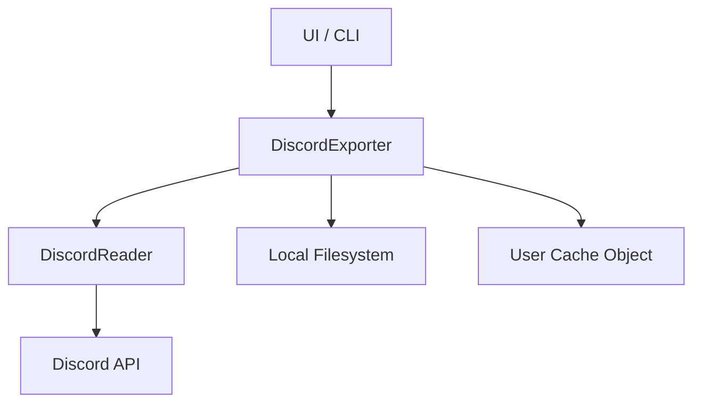

# Discord Reaper: Backup System Technical Specification

This document provides a deep-dive into the architecture, data lifecycle, and resilience strategies of the Discord Reaper backup system.

## 1. Architectural Overview

The backup system is built on a decoupled architecture that separates the API communication layer from the business logic and I/O operations.

-   **`DiscordReader` (API Provider)**: A high-level wrapper around the `discord.py` library. It handles authentication, rate limiting, and provides an asynchronous interface for fetching guild data, message history, and binary assets. It focuses on *fetching* rather than *processing*.
-   **`DiscordExporter` (Orchestration & Serialization)**: The core engine that defines the export lifecycle. It consumes data from the `Reader`, transforms it into standardized schemas, and manages local filesystem operations.

### Component Interaction Diagram



### File Tree Structure

```
DISCORD_BACKUP-{ServerID}/
├── server_profile/
│   ├── profile.json           # Server metadata (name, ID, icon/banner paths)
│   ├── roles.json             # All server roles (permissions, colors, positions)
│   ├── structure.json         # Full category and channel hierarchy
│   ├── assets.json            # Index of custom emojis and stickers
│   └── assets/                # Binary media files
│       ├── server_icon.png
│       ├── server_banner.png
│       ├── emoji_{name}_{id}.png
│       └── sticker_{name}_{id}.png
└── message_backup/
    ├── users/
    │   ├── user_info.json     # Deduplicated user profile cache
    │   └── avatars/           # User avatar images
    │       └── {user_id}.png
    └── {channel_id}/
        ├── messages.json      # Channel message history + metadata
        ├── attachments/       # Channel-level attachments
        │   └── {filename}-{id_last_5}.{ext}
        └── {thread_id}/       # Thread nested inside parent channel
            ├── thread_messages.json
            └── thread_attachments/
                └── {filename}-{id_last_5}.{ext}
```

---

## 2. Data Lifecycle & Serialization

### 2.1 Incremental Synchronization Algorithm
To achieve idempotency and efficiency, the system implements an incremental sync strategy using Discord's snowflake IDs.

1.  **State Loading**: The `Exporter` reads the existing `{channel_id}/messages.json` (if present).
2.  **Snowflake Extraction**: It extracts the `lastMessageID` from the metadata.
3.  **Filtered Fetch**: It calls `fetch_message_history(after_id=last_id)`.
4.  **In-Memory Merge**: New messages are appended to the existing list.
5.  **Atomic Write**: The updated JSON is written back to disk, ensuring that only new delta data is fetched from the API.

### 2.2 User Profile Deduplication (`user_info.json`)
The system avoids redundant storage of user metadata (usernames, roles, colors) by using a global `user_cache` map.
-   **Key**: `userID` (Snowflake).
-   **Policy**: Users are added to the cache only on their first appearance in any channel's history.
-   **Avatar Persistence**: User avatars are stored in `message_backup/users/avatars/` and referenced by relative paths in the JSON schemas.

---

## 3. Special Channel Type Specifications

### 3.1 Forum Channels & Threads
Forums present a hierarchical challenge where the "starter message" and the "conversation" exist in separate contexts.

-   **Forum Index (`{forum_id}/messages.json`)**: Contains an enriched list of "starter messages" representing each thread. These entries include thread titles, applied tags, and total attachment stats (summed from the entire thread).
-   **Thread Persistence**: All threads nest inside their parent channel directory:
    -   **Forum Threads**: `message_backup/{forum_id}/{thread_id}/thread_messages.json`
    -   **Regular Threads**: `message_backup/{parent_channel_id}/{thread_id}/thread_messages.json`
-   **Starter Identification**: The system uses `thread.history(limit=1, after=snowflake(thread_id - 1))` to reliably capture the first post even if it has been edited or pinned.

---

## 4. Resilience & Error Handling

### 4.1 Permission Resilience (403 Forbidden)
The system is designed to "fail-soft" when encountering restricted content:
-   **Server Level**: If the bot lacks `view_channel` or `read_message_history` globally, the backup aborts with a clear error.
-   **Channel Level**: If a specific channel is restricted, the error is logged, and the system proceeds to the next channel to ensure a partial backup is still completed.
-   **Asset Level**: If an emoji or sticker cannot be downloaded due to permissions, the metadata is preserved with a `null` local path.

### 4.2 Lottie Sticker Workaround
Discord's Lottie stickers (format: 3) are not supported by standard `discord.py` save methods. The system implements a bypass:
1.  Extracts the internal `aiohttp` session from the client: `client.http._HTTPClient__session`.
2.  Performs a direct `GET` request to the sticker URL.
3.  Streams the raw byte data directly to a `.json` file locally.

---

## 5. Technical Schemas

### 5.1 Message Object (`_format_message`)
The internal representation of a message focuses on portability:

| Field | Type | Description |
| :--- | :--- | :--- |
| `messageID` | `String` | Original Discord Snowflake |
| `type` | `String` | Normalized type (Text, ThreadStarter, Forward, etc.) |
| `timestamp` | `ISO8601` | Created date/time |
| `isPinned` | `Boolean` | Pin status |
| `content` | `String` | Raw markdown content (or snapshot content for forwards) |
| `userID` | `String` | Reference to `user_info.json` |
| `attachments`| `Array` | List of local file references and metadata |
| `embeds` | `Array` | Raw Discord-formatted embed objects |
| `stickers` | `Array` | List of Message Sticker objects (see below) |
| `reactions` | `Array` | List of Reaction objects |

#### Message Sticker Object
| Field | Type | Description |
| :--- | :--- | :--- |
| `id` | `String` | Sticker Snowflake ID |
| `name` | `String` | Sticker name |
| `format` | `String` | File format (PNG, APNG, LOTTIE, GIF) |
| `localPath` | `String` | Relative path to local file in `{channel_id}/attachments/` |

#### Reaction Object
| Field | Type | Description |
| :--- | :--- | :--- |
| `emoji` | `String` | String representation (`unicode` or `name:id`) |
| `count` | `Integer` | Total count of this reaction |

### 5.2 Asset Naming Logic
To prevent filename collisions (e.g., multiple files named `image.png`), the system uses a suffixing strategy:
`{filename_stem}-{snowflake_last_5}.{ext}`

Example: `sunset-54321.png`

### 5.3 `profile.json` Specification
Path: `server_profile/profile.json`

| Field | Type | Description |
| :--- | :--- | :--- |
| `name` | `String` | Original Discord guild name |
| `id` | `String` | Guild Snowflake ID |
| `icon` | `String` | Relative path to local guild icon in `server_profile/assets/` |
| `banner` | `String` | Relative path to local guild banner in `server_profile/assets/` |
| `last_backup` | `ISO8601` | Timestamp of the last successful backup run |
| `ignore_channels` | `Array` | List of channel Snowflakes explicitly excluded from backup |

### 5.4 `roles.json` Specification (Array of objects)
Path: `server_profile/roles.json`

| Field | Type | Description |
| :--- | :--- | :--- |
| `id` | `String` | Role Snowflake ID |
| `name` | `String` | Role name |
| `color` | `String` | Hex-string representation of role color (e.g. `"#ffffff"`) |
| `position` | `Integer` | Vertical position in the hierarchy (0 is bottom) |
| `permissions`| `Integer` | Bitwise integer representing the role's Discord permissions |
| `hoist` | `Boolean` | Whether the role is displayed separately in the sidebar |
| `mentionable`| `Boolean` | Whether the role can be mentioned |

### 5.5 `assets.json` Specification
Path: `server_profile/assets.json`
Contains two primary arrays: `emojis` and `stickers`.

#### Emoji Object
| Field | Type | Description |
| :--- | :--- | :--- |
| `id` | `String` | Emoji Snowflake ID |
| `name` | `String` | Emoji name (without colons) |
| `animated` | `Boolean` | True if the emoji is a GIF |
| `filename` | `String` | Filename within `server_profile/assets/` |

#### Sticker Object
| Field | Type | Description |
| :--- | :--- | :--- |
| `id` | `String` | Sticker Snowflake ID |
| `name` | `String` | Sticker name |
| `filename` | `String` | Filename within `server_profile/assets/` |

### 5.6 `structure.json` Specification (Array of Category objects)
Path: `server_profile/structure.json`

#### Category Object
| Field | Type | Description |
| :--- | :--- | :--- |
| `type` | `String` | Always `"category"` |
| `id` | `String` | Category Snowflake ID (or `"uncategorized"`) |
| `name` | `String` | Category name |
| `position` | `Integer` | Vertical position in hierarchy |
| `channels` | `Array` | List of Channel objects (see below) |

#### Channel Object
| Field | Type | Description |
| :--- | :--- | :--- |
| `id` | `String` | Channel Snowflake ID |
| `name` | `String` | Channel name |
| `type` | `String` | "text", "voice", "forum", "news", or "thread" |
| `position` | `Integer` | Vertical position within the category |
| `topic` | `String` | Channel description/topic (null if empty) |
| `nsfw` | `Boolean` | True if marked Restricted/NSFW |
| `available_tags` | `Array` | List of Forum Tag objects (see below) |

#### Forum Tag Object
| Field | Type | Description |
| :--- | :--- | :--- |
| `id` | `String` | Tag Snowflake ID |
| `name` | `String` | Tag display name |
| `moderated` | `Boolean` | True if restricted to moderators |
| `emoji_id` | `String` | ID of the tag's emoji (null if unicode/none) |
| `emoji_name` | `String` | Name of the tag's emoji |

### 5.7 `user_info.json` Specification (Array of User objects)
Path: `message_backup/users/user_info.json`

| Field | Type | Description |
| :--- | :--- | :--- |
| `userID` | `String` | User Snowflake ID |
| `username` | `String` | Current global username |
| `userNickname`| `String` | Server-specific nickname (display name) |
| `userColor` | `String` | Role-derived color for the user |
| `userIsBot` | `Boolean` | True if the account is a bot |
| `userRoles` | `Array` | List of role snippets (name, id, color, position) |
| `userAvatar` | `String` | Relative path to local avatar in `users/avatars/` |

### 5.8 Channel History JSON Specification
Path: `message_backup/{channel_id}/messages.json`

This file contains the full history of a channel along with synchronization metadata.

| Field | Type | Description |
| :--- | :--- | :--- |
| `channelName` | `String` | Human-readable name of the channel |
| `channelID` | `String` | Channel Snowflake ID |
| `channelType` | `String` | "Text", "Thread", "News", or "Forum" |
| `messageCount` | `Integer` | Total number of messages stored in the `messages` array |
| `threadCount` | `Integer` | (If Parent) Count of threads associated with this channel |
| `lastMessageID`| `String` | ID of the most recent message (used for incremental sync) |
| `totalAttachmentSizeBytes`| `Integer`| Summed size of all attachments for this channel |
| `numberOfAttachments` | `Integer`| Total count of attachments |
| `lastBackup` | `ISO8601` | Timestamp of last message fetch |
| `messages` | `Array` | The message objects (see Section 5.1) |
| `parentID` | `String` | (If Thread) Snowflake of the parent channel |

### 5.9 Thread History JSON Specification
Path: `message_backup/{channel_id}/{thread_id}/thread_messages.json`

Same schema as Section 5.8, with `channelType` set to `"Thread"` and `parentID` always present.

---

## 7. Backup Reader Implementation Guide

This section is a technical manual for developers building third-party tools (viewers, search engines, or analytics) to consume Discord Reaper backups.

### 7.1 Entry Point Discovery
A reader should start by identifying the backup root directory (prefixed with `DISCORD_BACKUP-`).

1.  **Parse `server_profile/profile.json`**: Extract the server name, ID, and assets (icon/banner).
2.  **Load `server_profile/structure.json`**: This defines the navigation tree for your UI.
    -   Iterate through categories.
    -   Map channels to their respective types (text, voice, forum).
    -   Store the `position` to preserve the original visual order.

### 7.2 Relational Data Mapping
The backup data is normalized to minimize duplication. A reader must implement the following resolve logic:

-   **User Resolution**: When parsing a message in `{channel_id}/messages.json`, the `userID` must be cross-referenced against the `userID` keys in `message_backup/users/user_info.json`.
-   **Role Resolution**: Use the `userRoles` array (IDs) from the user object and resolve them against the role metadata in `server_profile/roles.json` to get colors and names.
-   **Static Asset Resolution**:
    -   **Server Assets**: Prepend `server_profile/assets/` to filenames found in `server_profile/assets.json`.
    -   **User Avatars**: Resolve `userAvatar` paths found in `user_info.json` (pointing to `users/avatars/`).

### 7.3 Message Rendering Logic
When rendering the `messages` array from a channel JSON:

| Feature | Reader Implementation Logic |
| :--- | :--- |
| **Markdown** | Content is raw Discord markdown. Use a library like `markdown-it` with discord-specific plugins. |
| **Attachments** | Resolve `url` field (`{channel_id}/attachments/{filename}`) relative to the `message_backup/` directory. |
| **Emojis/Stickers** | If a message contains custom emojis/stickers, resolve their metadata via `server_profile/assets.json`. |
| **Replies** | Use the `reference` object to find the target `messageId`. Note: The target might be in the same file or a different channel/thread. |

### 7.4 Thread & Forum Reconstruction
Reconstructing the hierarchy requires specific pointer logic:

1.  **Forums**:
    -   Read `message_backup/{forum_id}/messages.json`.
    -   Each message in this file is a `ThreadStarter`.
    -   The `messageID` of the starter message *is usually* the same as the `thread_id`.
    -   To load the full thread, open `message_backup/{forum_id}/{thread_id}/thread_messages.json`.
2.  **Regular Threads**:
    -   Discoverable via the `parentID` field in any message or by scanning for `thread_messages.json` inside channel directories.
    -   Match the `thread.id` in a `ThreadStarter` message to the respective subdirectory.

---

## 8. Discord.py Model Hydration Guide

If you are building a `discord.py` API-compatible wrapper to read these backups directly into familiar Discord objects, here is the explicit property mapping from the schema to the standard `discord.py` object attributes.

### 8.1 Base Server (Guild)
File: `server_profile/profile.json` & `server_profile/roles.json` & `server_profile/structure.json`
-   **`discord.Guild`**:
    -   `id`: Cast `id` (str) to `int`.
    -   `name`: Mapped directly from `name`.
    -   `icon` / `banner`: Represented as `discord.Asset` objects. Use the local file paths from `icon` / `banner` as the asset URL/filepath.
    -   `roles`: Hydrated from `server_profile/roles.json`.
    -   `channels` / `categories`: Hydrated from `server_profile/structure.json`.

### 8.2 Roles (`discord.Role`)
File: `server_profile/roles.json`
-   `id`: Cast `id` to `int`.
-   `name`: Mapped directly.
-   `color`: Parse the hex string to `discord.Color(value)`.
-   `position`: Mapped directly.
-   `permissions`: Initialize `discord.Permissions(value=int(permissions))`.
-   `hoist`: Mapped directly to boolean.
-   `mentionable`: Mapped directly to boolean.

### 8.3 Users & Members (`discord.Member` / `discord.User`)
File: `message_backup/users/user_info.json`
-   `id`: Cast `userID` to `int`.
-   `name`: Mapped from `username`.
-   `display_name`: Mapped from `userNickname`.
-   `bot`: Mapped from `userIsBot`.
-   `color`: Parse `userColor` string to `discord.Color`.
-   `roles`: List of hydrated `discord.Role` objects via matching `id`s from the `userRoles` array.
-   `avatar`: Mocked `discord.Asset` using the `userAvatar` local path.

### 8.4 Channels (`discord.TextChannel`, `discord.CategoryChannel`, `discord.ForumChannel`)
File: `server_profile/structure.json`
-   Iterate over the top-level array (Categories):
    -   **`discord.CategoryChannel`**:
        -   `id`: Cast `id` to `int`.
        -   `name`: Mapped directly.
        -   `position`: Mapped directly.
-   Iterate over the nested `channels` array:
    -   **`discord.abc.GuildChannel` classes**:
        -   `id`: Cast `id` to `int`.
        -   `name`: Mapped directly.
        -   `position`: Mapped directly.
        -   `type`: Match the `type` string back to the `discord.ChannelType` enum.
        -   `category_id`: Inherited from the parent category block.
        -   `topic`: Mapped directly (if applicable).
        -   `nsfw`: Mapped directly to boolean.

### 8.5 Messages (`discord.Message`)
File: `message_backup/{channel_id}/messages.json` (Iterating the `messages` array)
-   `id`: Cast `messageID` to `int`.
-   `type`: Map the string `type` (e.g., "Default", "Reply") to `discord.MessageType`.
-   `created_at`: Parse `timestamp` (ISO-8601 string) into a timezone-aware `datetime` object.
-   `pinned`: Mapped from `isPinned`.
-   `content`: Mapped from `content`.
-   `author`: Resolve the `userID` against the loaded `discord.Member` mocks.
-   `embeds`: Instantiate using `discord.Embed.from_dict(embed_dict)` directly on the elements of the `embeds` array.
-   **Reference (Replies)**:
    -   If `reference` exists, hydrate a `discord.MessageReference`.
    -   `message_id`: Cast `reference.messageId` to `int`.
    -   `channel_id`: Cast `reference.channelId` to `int`.

### 8.6 Attachments (`discord.Attachment`)
Nested within Message objects.
-   `id`: Cast `id` to `int`.
-   `filename`: Mapped from `fileName`.
-   `size`: Mapped from `fileSizeBytes`.
-   `url` / `proxy_url`: Point to the local relative path (`{channel_id}/attachments/{resolved_filename}`).

### 8.7 Reactions (`discord.Reaction` & `discord.PartialEmoji`)
Nested within Message objects.
-   `count`: Mapped from `count`.
-   `emoji`: Iterate the `emoji` string. If custom (contains a `:`), split it to mock a `discord.PartialEmoji(name=..., id=...)`. Otherwise, mock standard unicode strings.
