# Fluxer Reaper

Fluxer Reaper is a simple tool to help you move an entire Discord server over to a Fluxer community. It handles channels, roles, emojis, and even your message history.

## Features

### 1. Clone Server Template
*   **Structure Sync**: Automatically creates all your Discord categories and channels in Fluxer.
*   **Property Migration**: Copies channel topics, NSFW status, and slowmode settings.
*   **Deduplication**: Reads Fluxer for existing channels to prevent duplicates.
*   **Category Linking**: Ensures channels are automatically placed within their correct categories.

### 2. Copy Roles & Permissions
*   **Role Migration**: Copies roles, colors, and basic permissions.
*   **Permission Sync**: Mirrors category and channel-specific role overwrites.

### 3. Copy Emojis & Stickers
*   **Asset Migration**: Downloads and uploads custom emojis and stickers.
*   **Flexible Sync**: Options to sync emojis only, stickers only, or both.

### 4. Sync Server Identity
*   **Metadata Sync**: Syncs your server name, icon, and banner.
*   **Component Selection**: Options to sync only specific components.

### 5. Migrate Message History
*   **Masquerade User**: Uses webhooks to mirror original user avatars and nicknames for a seamless transition.
*   **Contextual Pairing**: Easily map Discord channels to their Fluxer counterparts.
*   **Flexible Start Points**: Start from the oldest message, a specific custom message ID/link, or continue from where you left off.
*   **Rich History**: Migrates message content, author markers, and attachments.
*   **Thread Support**: Handles threads with dedicated markers in the target channel.

### 6. Configuration & Validation
*   **Real-time Validation**: Audits bot tokens and IDs for validity.
*   **Permission Checks**: Checks if bots have the required Intents and Permissions.

### 7. Danger Zone
*   **Wipe Options**: Irreversibly delete channels, roles, or assets to clear a community.
*   **Permission Reset**: Batch-wipe all channel permission overwrites.

## Notes:
- The Discord bot has read-only access to the source server. Hence no changes will be made to the source server.
- Currently Fluxer is unstable probably due to high traffic, migrating servers now will only add to that problem. Only use this for testing purposes for now. [Check status here](https://fluxerstatus.com)

# Bot Setup

# 1) Fluxer Bot

Go to your **user settings** in Fluxer (**Ctrl** + **,**) and **Create Application**
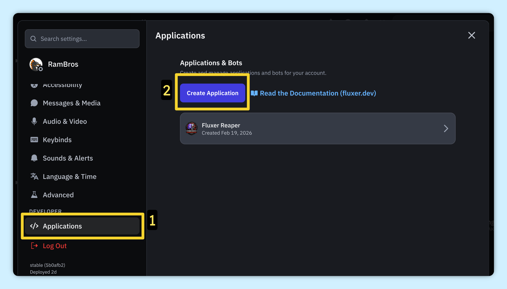

**Name your bot**
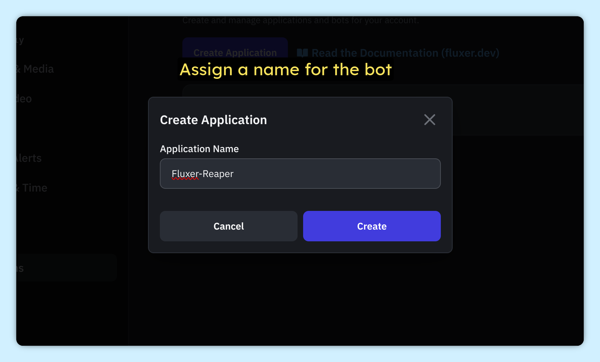

**Regenerate** & copy the **Bot Token**. Save it somewhere safe, you will need it later for the tool
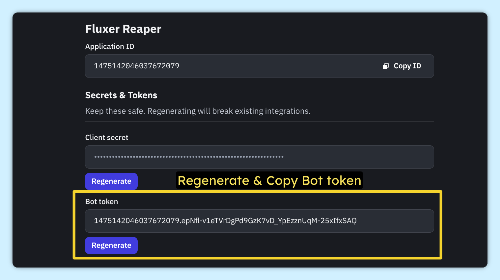

Scroll down to **Scopes** and select **bot**. Enable **Administrator** under Bot Permissions
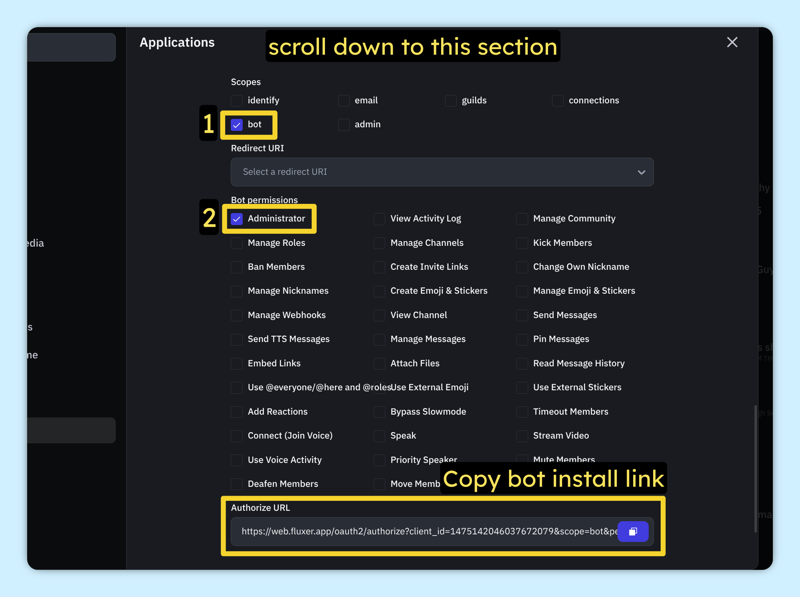

Choose your **Fluxer Community** (Preferably create and use a new one)

**Authorize** & Add the bot to your community
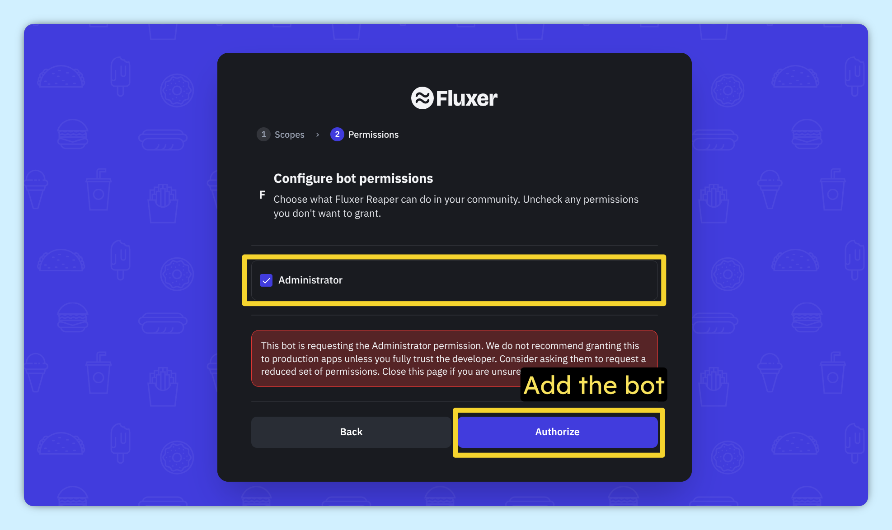

## 2) Discord Bot

Go to https://discord.com/developers/applications & create **New Application**
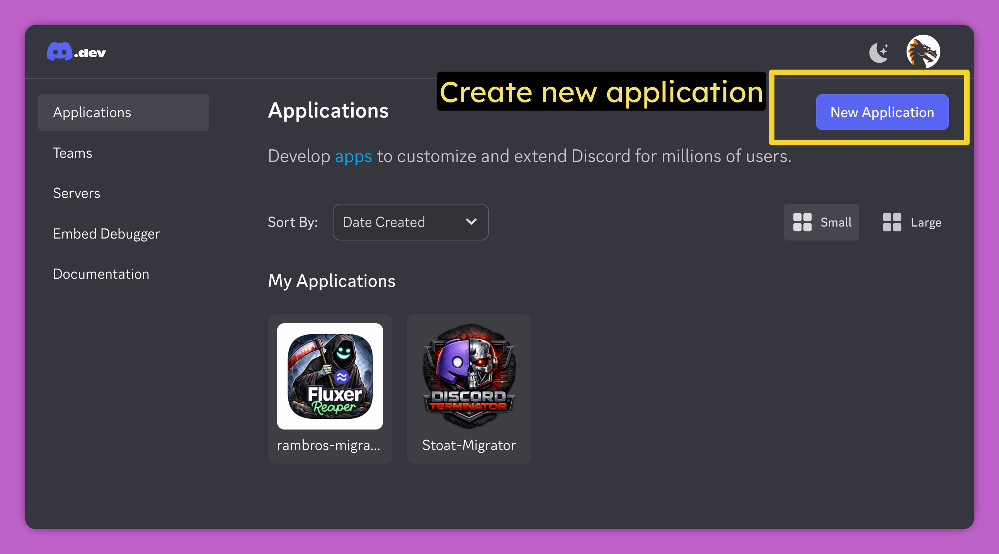

**Name your bot**
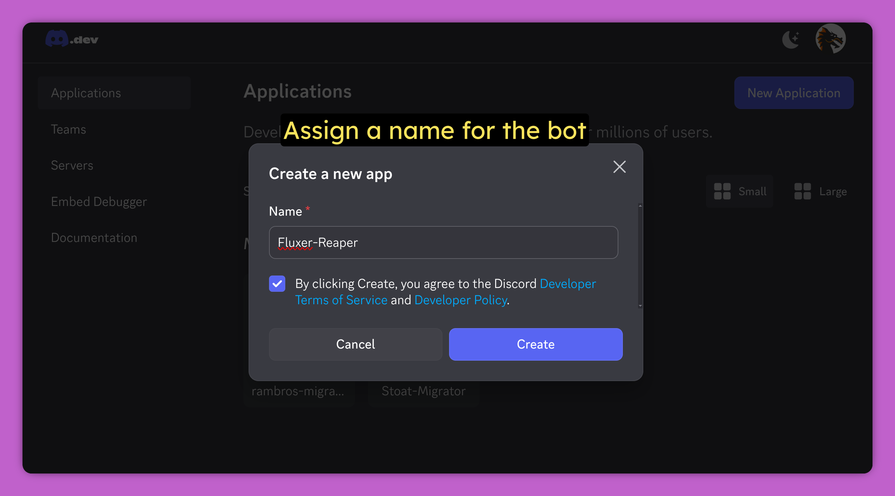

In the bot Settings, enable **Message Content Intent**
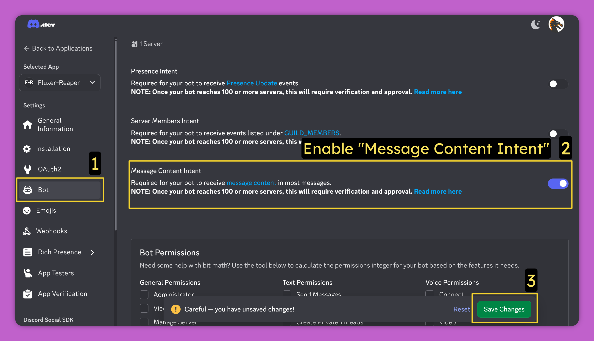

**Regenerate** & copy the **Bot Token**. Save it somewhere safe, you will need it later for the tool
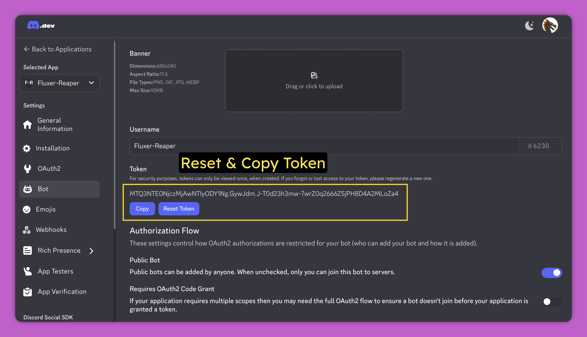

Under **Installation** section, enable these:
- Scopes: **bot**
- Permissions: **Read Message History** , **View Channels**

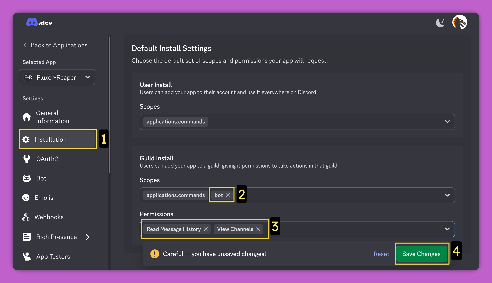

Finally open the **Install link** and add the bot to your Discord server
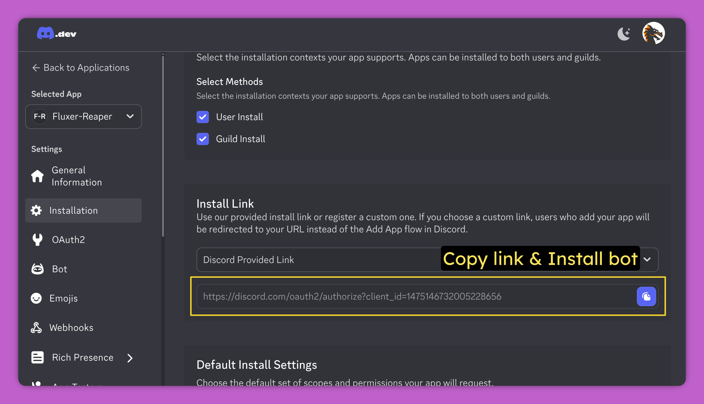

## Getting Started

### 1. Download
Download the latest executable from the [Releases](https://github.com/rambros3d/fluxer-reaper/releases) page & unzip it.

### 2. Run
Simply run the downloaded file to start the tool. No Python installation is required.
- **linux**: run the **fluxer-reaper** file (bash **./fluxer-reaper** if terminal doesnt open automatically)
- **windows**: run the **fluxer-reaper.exe** file

### Documentation
Detailed info about the code can be found at https://deepwiki.com/rambros3d/fluxer-reaper

## Vibe Code Notice

- Code is provided as is; This tool was developed with AI.
- Take it, use it, modify it, feel free to do whatever you wish.