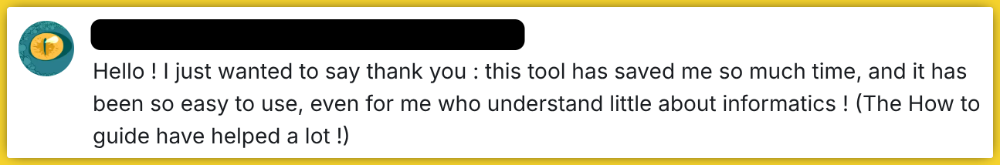
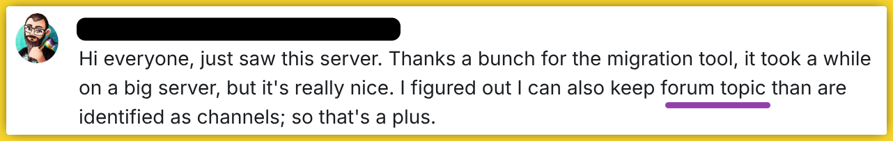

# DiscoReaper

**DiscoReaper** is a powerful tool designed to help you migrate your entire Discord server to Fluxer or Stoat. It clones channels, roles, emojis, permissions, and also your community's full message history.

>Join our [**Reaper Community**](https://fluxer.gg/9KxDP8WH) if you need help or have any questions.


### Modern Terminal Interface
The tool now features a unified, intuitive TUI (Terminal User Interface) - no more commands

| Features | Fluxer | Stoat |
| :--- | :---: | :---: |
| **Server Template** |  |  |
| - Copy Categories & Channels | 🟩 | 🟩 |
| - Category Linking | 🟩 | 🟩 |
| - Channel Topic/Description | 🟩 | 🟩 |
| - NSFW Status | 🟩 | 🟩 |
| - Slowmode | 🟩 | ⚠️ |
| **Roles & Permissions** |  |  |
| - Roles Cloning | 🟩 | 🟩 |
| - Roles Permissions | 🟩 | 🟩 |
| - Category Permissions | 🟩 | ⚠️ |
| - Channel Permissions | 🟩 | ⏳to be done |
| **Emojis & Stickers** |  |  |
| - Copy Emojis | 🟩 | 🟩 |
| - Copy Stickers | 🟩 | ⚠️ |
| **Server Identity** |  |  |
| - Server Name | 🟩 | 🟩 |
| - Server Icon | 🟩 | 🟩 |
| - Server Banner | 🟩 | 🟩 |
| **Message Message history** |  |  |
| - Text Messages | 🟩 | 🟩 |
| - File Attachments | 🟩 | 🟩 *some file extensions not supported*|
| - Preserve Reply Links | 🟩 | 🟩 |
| - Webhook Embeds | 🟩 | 🟩 |
| - Threads | 🟩 | 🟩 |
| - Forums | ⚠️ | ⚠️ |

- ⚠️**Fluxer/Stoat**: Threads & Forums type channels are not yet natively available. As a workaround, threads are migrated in their parent channels as normal messages. 
- ⚠️**Stoat**: doesn't have features like Category Permissions or Slowmode settings for channels.
- ⏳**Stoat**: permission sync for channels is pending due to architectural differences.

---

### Core Operations

#### 📦 Local Backup (Backup & Migrate)
Create full, local backups of your Discord servers. 
- **Server Profile**: Export server identity, categories, channels, roles, and emojis.
- **Message Backup**: Save total message history, including attachments and threads, to your disk.
- **Migration Source**: Use your local backups as a source for migrations, allowing you to move to Fluxer even if you no longer have access to the original Discord server.

#### Shuttle Transfer (Direct Migration)
Migrate directly from Discord or your Local Backups to the target community.
- **Server Clone**: Transfer the entire server structure, roles, and assets in one click.
- **Server Sync**: Sync channel names, topics, and permissions between servers.
- **Message Migration**: Transfer years of history with support for incremental sync (picking up where you left off).

### Notable Features
*   **Sequential Batch Execution**: Select multiple channels, emojis, or roles and let the tool handle them one by one.
*   **Confirmation Previews**: See what's about to happen (name changes, logo updates, counts) before you continue.
*   **Incremental Migration**: Tracks already migrated messages to avoid duplicates and save time on large servers.
*   **Flexible Start Points**: Migrating history can start from the first message, a specific message ID (to be implemented), or continue from the last saved state.
*   **Audit Channel**: Live logging of migration progress directly in your target server.

### ⚠️ Danger Zone
*   **Full Wipe**: Clean out categories, channels, roles, or assets to reset a community for a fresh start.
*   **Permission Reset**: Batch-wipe all channel permission overwrites in the target server.
*   **Safety First**: All destructive actions require a dedicated confirmation step and data-fetching preview.

### Notes:
- The Reaper has **read-only access** to the source Discord server, so your original data is never touched.
- Currently, Fluxer experiences stability issues during high traffic. Use cautiously for large migrations. Check status at [fluxerstatus.com](https://fluxerstatus.com).

# Getting Started

#### Setup the bots as per this [guide](BOT-SETUP.md)

### Option 1: Using Pre-built Binaries (Easiest)
1. **Download**: Grab the latest version from the [Releases](https://github.com/rambros3d/disco-reaper/releases) page.
2. **Run**:
   - **Linux**: Run the `disco-reaper` binary (e.g., `./launch.sh` or double-click).
   - **Windows**: Run `disco-reaper.exe`.

### Option 2: Running from Source (To use latest unstable code)
1. **Clone**: Clone the repository to your local machine:
   ```bash
   git clone https://github.com/rambros3d/disco-reaper.git
   cd disco-reaper
   ```
2. **Launch**: Run the appropriate launcher script for your OS. It will automatically create a virtual environment and install dependencies:
   - **Linux**: `./launch-app.sh`
   - **MacOS**: `./launch-app-MAC.sh`
   - **Windows**: Double-click `launch-app-WIN.bat`

---
## What do the people say




### No regrets walking away from Discord

Dear Discord, The Reaper has a [message for you](https://c.tenor.com/dq8yuzNDkWkAAAAd/tenor.gif).

---
---
## Discord Age Verification Misconceptions

Discord’s latest operation just proves they never cared about you or your kids' safety.

### Age verification protects kids
- Online safety of your kids should be your responsibility.
- The big tech and especially the government should stay away from the kids. Period. 
- Do you think they care about your kids' safety, Really?


### Its the Law
>Discord is rolling out age verification in all countries; even when not required by law.

>**Big tech companies didn't comply with the laws when mishandling our data.**
Now they suddenly seem to care when complying with age verification laws (as they can grab even more data).

- Point being, in either case they never cared about the us. As we are their product anyway
- I dont expect these companies to stand up for our rights against these dystopian laws.


### Discord ID verification is "privacy-preserving"

>Discord initially **fooled everyone** that it will be optional and the verification data wont leave the device.
But now their own website states that **Persona** will be used in some countries, its brought to you by the same guy involved with [**Palantir**](https://corbettreport.com/what-does-palantir-actually-do/).

### **Just say NO** to invasive companies & Move to platforms that respects you.

---
---

### Documentation
- [](https://reaper.rambros3d.com/) - view bot setup guides, tool usage guides, and backup viewer
- [](https://deepwiki.com/rambros3d/disco-reaper) - incredibily good AI docs

### Vibe Code Notice

- Code is provided as is; This tool was developed with AI.
- Take it, use it, modify it, feel free to do whatever you wish.

### Star History

[](https://www.star-history.com/?repos=rambros3d%2Fdisco-reaper&type=date&legend=top-left)

---