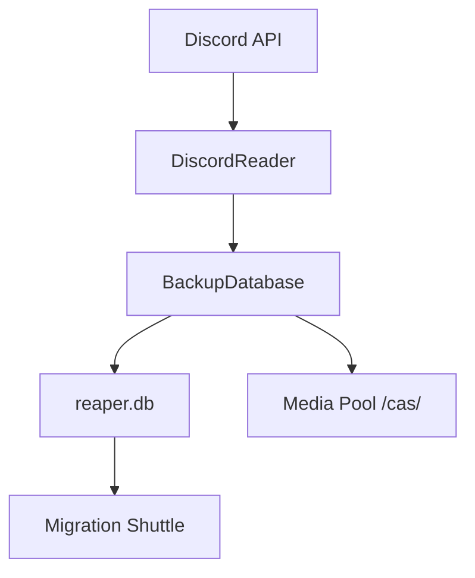

# Discord Reaper: Backup System Technical Specification

Discord Reaper uses a high-performance **SQLite-based** backup system designed to handle massive community snapshots with millions of messages, deduplicated media, and cross-session persistence.

---

## 1. Architectural Overview

The backup system has transitioned from a legacy JSON-based flat-file structure to a central **SQLite Database** (`reaper.db`) architecture. This allows for:
- **O(1) lookups**: Instant mapping of original message IDs to target message IDs.
- **Memory Efficiency**: The system no longer loads massive message lists into RAM; it streams data directly from disk.

### Component Relationship

---

## 2. The Database Schema (`reaper.db`)

The backup is stored in a single SQLite file, typically found in your `ReaperFiles-{ServerID}/` directory. The schema is normalized to prevent redundancy.

### Core Tables
*   **`guild_profile`**: Stores server name, ID, description, owner, and icon/banner URLs.
*   **`roles` & `permissions`**: Captures every custom role (colors, bits) and complex channel-specific permission overwrites.
*   **`channels` & `threads`**: Detailed metadata including category nesting, NSFW flags, bitrates, and thread archive statuses.
*   **`messages`**: The central history table. Stores sender IDs, timestamps, content, and references.
*   **`attachments` / `embeds` / `reactions`**: Relational tables linked to `messages` for storing rich data.
*   **`users`**: A deduplicated author cache (usernames, avatars, server roles).
*   **`user_alias`**: Stores mapping between User IDs and their generated "Privacy Aliases" (e.g., `SwiftFox`).

---

## 3. Media Pool & CAS Logic

Reaper implements a **Content-Addressable Storage (CAS)** system for all media (images, videos, stickers, avatars).

### How it works:
1.  **Hashing**: When a file is downloaded, Reaper calculates its **SHA-256 hash**.
2.  **Deduplication**: If another message contains the exact same image (even years later or in a different channel), Reaper sees the hash already exists in the `media_pool` table.
3.  **Referencing**: Instead of downloading the file again, Reaper simply creates a reference to the existing file in the `/cas/` directory.

**Benefit**: This significantly reduces the disk footprint of backups for servers where users frequently share the same memes or assets.

---

## 4. Incremental Synchronization

Reaper uses the **Snowflake ID** logic to perform "Delta Backups":
1.  **Scan**: The system queries the `messages` table for the highest (newest) ID in a specific channel.
2.  **Fetch**: It then calls the Discord API to fetch messages `after` that specific ID.
3.  **Merge**: Only the brand-new messages are inserted into the database.

This makes "keeping a backup updated" an extremely fast operation, even for servers with millions of existing messages.

---